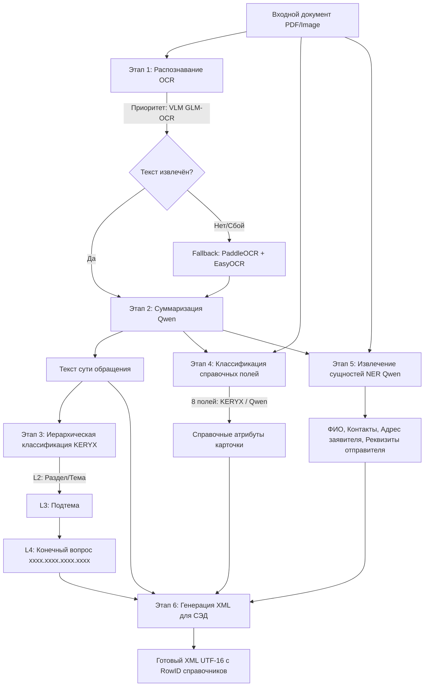

# AI for Appeals: Саммари проекта

## 1. Назначение и бизнес-контекст

**AI for Appeals** — система интеллектуальной автоматизации обработки и первичной маршрутизации входящих обращений граждан в администрацию города (на примере г. Челябинска и типовых муниципальных образований РФ).

### Проблема
В администрацию ежедневно поступают сотни обращений от жителей в виде сканированных документов (рукописных или печатных), текстовых файлов, электронных писем. Сотрудники общего отдела / канцелярии вручную:
1. Читают документ и выделяют ключевую суть.
2. Определяют тематику по многоуровневому Общероссийскому тематическому классификатору обращений граждан Администрации Президента РФ (4 уровня иерархии, код формата `xxxx.xxxx.xxxx.xxxx`).
3. Заполняют десятки справочных атрибутов карточки обращения (вид, тип, форма обращения, источник поступления, первичность/повторность, место события, район и категория заявителя).
4. Извлекают персональные данные заявителя (ФИО, адрес, контакты) и реквизиты сторонних организаций-отправителей (исходящий номер и дата для сопроводительных писем).
5. Заводят карточку в ведомственной системе электронного документооборота (СЭД).

### Цель и результат работы системы
На вход подаётся скан/документ обращения (PDF, JPG, PNG, TIFF). На выходе система формирует валидный **XML-файл** карточки обращения, готовый к автоматическому импорту в СЭД (со всеми GUID/RowID из ведомственных справочников).

---

## 2. Архитектура пайплайна обработки (Core Pipeline)

Актуальный боевой контур системы сосредоточен в каталоге [src/DEMO](file:///c:/Users/Sasha/PycharmProjects/AI_for_appeals/src/DEMO) и сервисах верхнего уровня [watcher.py](file:///c:/Users/Sasha/PycharmProjects/AI_for_appeals/watcher.py) и [api.py](file:///c:/Users/Sasha/PycharmProjects/AI_for_appeals/api.py).



---

## 3. Детальное описание этапов и используемых технологий

### Этап 1: Распознавание текста (OCR & Text Extraction)
Реализован в [src/DEMO/text_extraction](file:///c:/Users/Sasha/PycharmProjects/AI_for_appeals/src/DEMO/text_extraction).
1. **Основной движок: GLM-OCR (VLM)** ([text_extraction_glm_ocr.py](file:///c:/Users/Sasha/PycharmProjects/AI_for_appeals/src/DEMO/text_extraction/text_extraction_glm_ocr.py))
   - Страницы PDF/изображения рендерятся в картинки через `pdf2image` (Poppler).
   - Картинка передаётся в Vision-Language Model `glm-ocr`, развернутую на сервере через **LM Studio** (OpenAI-compatible API).
   - VLM сохраняет структуру документа, абзацы и таблицы в Markdown, исключая артефакты обычных OCR-библиотек.
2. **Резервный движок (Fallback): PaddleOCR + EasyOCR** ([text_extraction_paddle.py](file:///c:/Users/Sasha/PycharmProjects/AI_for_appeals/src/DEMO/text_extraction/text_extraction_paddle.py))
   - Сначала проверяется наличие цифрового текстового слоя (`pdfminer.six`, `pdfplumber`).
   - Для сканов запускается `PaddleOCR` (модели `PP-OCRv5_server_det` и `eslav_PP-OCRv5_mobile_rec`).
   - Для латинских символов и email используется `EasyOCR`.
   - Встроена постобработка: замена кириллических гомоглифов в email/доменах (`CYRILLIC_TO_LATIN`), парсинг телефонов по регулярным выражениям (`PHONE_RE`).

### Этап 2: Суммаризация текста
Реализован в [src/DEMO/functional/qwen_make_summary.py](file:///c:/Users/Sasha/PycharmProjects/AI_for_appeals/src/DEMO/functional/qwen_make_summary.py).
- Модель: **Qwen** (`qwen/qwen3.5-9b`), запущенная в LM Studio.
- Формирует сжатое изложение сути обращения (1–2 предложения) с сохранением ключевых фактов (кто обращается, на что жалуется, чего просит).
- Полученная выжимка передаётся далее в классификатор тематик и в поле `Content` итогового XML.

### Этап 3: Иерархическая классификация тематик (L2 -> L3 -> L4)
Реализован в [src/DEMO/functional/keryx_classifier.py](file:///c:/Users/Sasha/PycharmProjects/AI_for_appeals/src/DEMO/functional/keryx_classifier.py) и загрузчике [src/DEMO/loading/keryx_loader.py](file:///c:/Users/Sasha/PycharmProjects/AI_for_appeals/src/DEMO/loading/keryx_loader.py).
- Модели: Семейство **KERYX** (дообученные русскоязычные Cross-Encoder/NLI классификаторы: `KERYX_PATH_L2`, `KERYX_PATH_L3`, `KERYX_PATH_L4`).
- Справочник: [data/classifier/cats2.json](file:///c:/Users/Sasha/PycharmProjects/AI_for_appeals/data/classifier/cats2.json), `cats3.json`, `cats4.json` (Классификатор Администрации Президента РФ).
- Логика каскада:
  - **L2** (Раздел): классифицируется суммаризация обращения. Отбираются классы с вероятностью $\ge \text{max\_score} \times 0.9$.
  - **L3** (Подтема): для отобранных L2 берутся дочерние узлы с префиксом родителя (`"Раздел → "`), порог $\ge \text{max\_score} \times 0.8$.
  - **L4** (Конечный вопрос): для отобранных L3 берутся дочерние темы с полным путем (`"Раздел → Подтема → "`), порог $\ge \text{max\_score} \times 0.8$.
- Поддерживает мульти-лейбл классификацию (одно обращение может затрагивать несколько тем).

### Этап 4: Классификация справочных полей (Reference Fields)
Реализован в [src/DEMO/functional/keryx_REF_classification.py](file:///c:/Users/Sasha/PycharmProjects/AI_for_appeals/src/DEMO/functional/keryx_REF_classification.py) (альтернатива на Qwen: [qwen_REF_classification.py](file:///c:/Users/Sasha/PycharmProjects/AI_for_appeals/src/DEMO/functional/qwen_REF_classification.py)).
Классифицирует 8 служебных полей карточки:
1. `AppealKind` (Вид обращения: заявление, жалоба, предложение)
2. `StatusId` (Тип обращения)
3. `ItemID` (Форма обращения: письменное, электронное, устное и др.)
4. `DeliveryTypeId` (Источник поступления: почта, лично, через интернет-приемную и т.д.)
5. `RegistrationPlaceId` (Место события)
6. `ConsiderationType` (Первичное `0`, повторное `1`, неоднократное `2`)
7. `PetitionerCategory` (Категория заявителя: гражданин, пенсионер, участник СВО, многодетная семья и др.)
8. `PetitionerDistrict` (Район проживания заявителя)

### Этап 5: Извлечение именованных сущностей (NER)
Реализован в [src/DEMO/functional/qwen_NER_inference.py](file:///c:/Users/Sasha/PycharmProjects/AI_for_appeals/src/DEMO/functional/qwen_NER_inference.py).
Использует три узкоспециализированных промпта к Qwen (split prompts approach):
- **Персональные данные**: `FIRST_NAME`, `LAST_NAME`, `MIDDLE_NAME`, `PHONE_NUMBER`, `PERSONAL_EMAIL`, `GOV_EMAIL`, `DATE` (дата документа в ISO 8601).
- **Адресные данные**: `POSTAL_CODE`, `REGION`, `CITY`, `STREET`, `HOUSE`, `ROOM`.
- **Данные организации-отправителя**: `SENDER_ORG` (с привязкой к эталонному списку из `orgs.xml`), `EXTERNAL_NUMBER`, `EXTERNAL_DATE`.
- **Постобработка** ([run_single.py](file:///c:/Users/Sasha/PycharmProjects/AI_for_appeals/src/DEMO/running/run_single.py)): валидация и нормализация email, капитализация ФИО, сборка полного адреса `FULL_ADDRESS`.

### Этап 6: Генерация XML для СЭД
Реализован в [src/DEMO/functional/xml_export.py](file:///c:/Users/Sasha/PycharmProjects/AI_for_appeals/src/DEMO/functional/xml_export.py).
- Загружает системные справочники [all_refs(but_orgs).xml](file:///c:/Users/Sasha/PycharmProjects/AI_for_appeals/data/classifier/all_refs(but_orgs).xml) и [orgs.xml](file:///c:/Users/Sasha/PycharmProjects/AI_for_appeals/data/classifier/orgs.xml).
- Сопоставляет текстовые названия классов и организаций с их внутренними системными идентификаторами (`RowID`).
- Формирует XML-структуру (`MainData`, `QuestionData`, `PetitionerData`, `SenderData`) в кодировке **UTF-16** с XML-декларацией.

---

## 4. Способы запуска и интерфейсы

1. **Сервис горячей папки (Hot Folder Watcher)** — [watcher.py](file:///c:/Users/Sasha/PycharmProjects/AI_for_appeals/watcher.py)
   - Использует библиотеку `watchdog`.
   - Мониторит папку `input/`.
   - При появлении файла ждёт стабилизации размера (`wait_until_file_is_ready`), прогоняет через пайплайн, сохраняет XML в `output/`, а исходный файл переносит в `processed/` (или `errors/`).
2. **REST API** — [api.py](file:///c:/Users/Sasha/PycharmProjects/AI_for_appeals/api.py)
   - Построен на FastAPI.
   - Эндпоинт `POST /api/v1/process` принимает JSON с текстом и возвращает JSON с суммаризацией, кодами L2/L3/L4, полями и сущностями.
3. **Веб-демо (UI)** — [src/DEMO/running/app.py](file:///c:/Users/Sasha/PycharmProjects/AI_for_appeals/src/DEMO/running/app.py)
   - Построен на Gradio.
   - Позволяет загрузить PDF через браузер, визуально увидеть суммаризацию, рубрику L4, таблицы справочных полей и данных заявителя, а также сгенерировать XML.
4. **Пакетная оценка качества (Batch Benchmark)** — [src/DEMO/running/run_batch.py](file:///c:/Users/Sasha/PycharmProjects/AI_for_appeals/src/DEMO/running/run_batch.py)
   - Запускает инференс по тестовой выборке (например, 100 обращений).
   - Считает Exact Accuracy, Partial Accuracy, Mean Jaccard по уровням классификатора, а также поэлементную точность NER и справочных полей.

---

## 5. Структура каталогов репозитория

```
AI_for_appeals/
├── api.py                     # FastAPI веб-сервер
├── watcher.py                 # Сервис горячей папки (watchdog)
├── configs/
│   └── requirements.txt       # Внешние зависимости и ссылки на бинарники
├── data/                      # Датасеты и справочники
│   ├── classifier/            # cats1-4.json, all_refs.xml, orgs.xml, category_fields.json
│   ├── sets_to_learn/         # Выборки для дообучения и тестирования
│   └── all_appeals_new_OCR/   # Распознанные корпуса обращений
├── src/
│   ├── DEMO/                  # БОЕВОЙ ПРОДУКТОВЫЙ КОНТУР
│   │   ├── functional/        # Функции классификации, суммаризации, NER, XML-экспорта
│   │   ├── loading/           # Загрузчики моделей (KERYX, Qwen/LM Studio, GigaChat, справочники)
│   │   ├── running/           # Точки входа (run_single, run_batch, app.py)
│   │   ├── text_extraction/   # Модули OCR (GLM-OCR VLM, PaddleOCR + EasyOCR)
│   │   ├── logs/              # Лог-файлы работы демо
│   │   └── xmls/              # Результаты выгрузки XML
│   ├── features/              # Утилиты подготовки данных и конвертации разметки
│   ├── fine-tuning/           # Скрипты дообучения KERYX (поля и иерархия)
│   ├── training/              # Дообучение моделей NER
│   ├── evaluation/            # Скрипты тестирования OCR и NER
│   └── embeddings/            # Эксперименты с векторным представлением и ChromaDB
└── models/                    # (Игнорируется в git) Локальные веса моделей KERYX
```

---

## 6. Технологический стек

| Категория | Технологии |
|---|---|
| Язык и среда | Python 3.10+, Windows (локально) / Linux (сервер с GPU) |
| Deep Learning | PyTorch (CUDA), Transformers, Accelerate |
| LLM / VLM Server | **LM Studio** (OpenAI-compatible API `v1/chat/completions`) |
| Нейросетевые модели | • **Qwen 3.5 9B** (суммаризация, NER, fallback классификации)<br>• **GLM-OCR** (VLM распознавание структуры документа)<br>• **KERYX** (серия дообученных cross-encoders для иерархии L2-L4 и 8 полей)<br>• *(Архив)* **GigaChat-Lite** |
| OCR библиотеки | PaddleOCR (PP-OCRv5), EasyOCR, pdf2image (Poppler), pdfminer.six, pdfplumber, Pillow |
| Web & API | FastAPI, Uvicorn, Pydantic, Gradio |
| Интеграция | Watchdog, XML ElementTree (UTF-16) |
