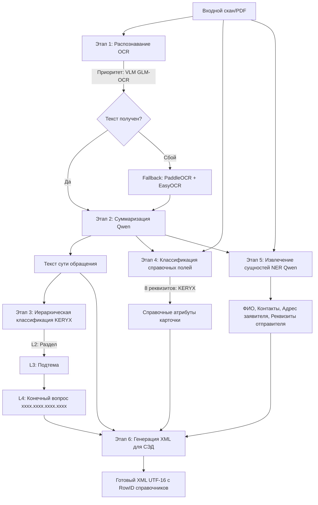

# AI for Appeals: Саммари проекта

## 1. Назначение и бизнес-контекст

**AI for Appeals** — система автоматической обработки, распознавания и первичной классификации входящих обращений граждан в администрацию города (на базе Тематического классификатора Администрации Президента РФ).

### Проблема и цель
Канцелярия вручную разбирает сотни сканов и писем в день, тратя по 10–15 минут на документ (определение кодов `xxxx.xxxx.xxxx.xxxx`, заполнение реквизитов, извлечение ФИО/адресов). 
**Цель системы**: принять скан/документ (PDF, изображение), автоматически распознать текст, определить тематику L2→L3→L4, извлечь реквизиты и сущности (NER), и сформировать валидный **XML-файл** карточки обращения для импорта в СЭД (DocsVision / типовые ведомственные системы).

---

## 2. Архитектура пайплайна (Core Pipeline)

Актуальный боевой контур сосредоточен в каталоге [src/DEMO](file:///c:/Users/Sasha/PycharmProjects/AI_for_appeals/src/DEMO) и сервисах [watcher.py](file:///c:/Users/Sasha/PycharmProjects/AI_for_appeals/watcher.py) и [api.py](file:///c:/Users/Sasha/PycharmProjects/AI_for_appeals/api.py).



---

## 3. Ключевые компоненты и модели

1. **Распознавание текста (OCR)** ([src/DEMO/text_extraction](file:///c:/Users/Sasha/PycharmProjects/AI_for_appeals/src/DEMO/text_extraction)):
   - **GLM-OCR (VLM)**: основной движок через локальный LM Studio API. Сохраняет структуру страниц, абзацы и таблицы в Markdown.
   - **PaddleOCR + EasyOCR**: резервный гибридный движок для сканов с цифровым слоем и нормализацией гомоглифов.
2. **Суммаризация и NER** ([src/DEMO/functional](file:///c:/Users/Sasha/PycharmProjects/AI_for_appeals/src/DEMO/functional)):
   - **Qwen** (семейство Qwen2.5/3.5 в LM Studio): суммаризация сути обращения (1–2 предложения) и извлечение сущностей тремя специализированными промптами (персональные данные, адрес, организация-отправитель).
3. **Классификация (KERYX)** ([src/DEMO/loading/keryx_loader.py](file:///c:/Users/Sasha/PycharmProjects/AI_for_appeals/src/DEMO/loading/keryx_loader.py)):
   - Дообученные русскоязычные NLI/Cross-Encoder модели (PyTorch/CUDA).
   - Каскад L2→L3→L4 с контекстным обогащением родительскими префиксами и относительной фильтрацией мультилейбла.
   - Классификация 8 служебных реквизитов (`ConsiderationType`, `DeliveryTypeId`, `AppealKind` и др.).
   - **Управляемая загрузка**: ленивая инициализация (PEP 562 `__getattr__`) без побочных эффектов импорта + Warm Start при старте сервисов.
4. **Генерация XML** ([xml_export.py](file:///c:/Users/Sasha/PycharmProjects/AI_for_appeals/src/DEMO/functional/xml_export.py)):
   - Сопоставление сущностей со справочниками СЭД (`all_refs.xml`, `orgs.xml`) и выгрузка UTF-16 XML с привязкой `RowID`.

---

## 4. Конфигурация, сервисы и запуск

1. **Централизованная конфигурация и логирование**:
   - [src/DEMO/paths_config.py](file:///c:/Users/Sasha/PycharmProjects/AI_for_appeals/src/DEMO/paths_config.py): единая точка правды для всех путей, директорий и параметров LM Studio с автоматическим автоопределением корня и поддержкой `.env`.
   - [src/DEMO/logger_config.py](file:///c:/Users/Sasha/PycharmProjects/AI_for_appeals/src/DEMO/logger_config.py): изолированное логирование без взаимных конфликтов (`watcher.log`, `run_single.log`, `run_batch.log`, `api.log`, `app.log`).

2. **Сервис горячей папки ([watcher.py](file:///c:/Users/Sasha/PycharmProjects/AI_for_appeals/watcher.py))**:
   - Архитектура **Producer — Consumer** на базе `queue.Queue`.
   - Поток `watchdog` мгновенно регистрирует файлы без блокировок.
   - Выделенный одиночный рабочий поток (`WatcherWorker`) предотвращает пики видеопамяти (CUDA OOM).
   - Защита от дублей событий ОС, сохранение отчётов об ошибках `<файл>.error.txt` в `errors/` и Graceful Shutdown (Ctrl+C).

3. **Другие точки входа**:
   - `python -m src.DEMO.running.run_single <файл>` — разовый прогон документа.
   - `python -m src.DEMO.running.run_batch` — пакетное тестирование точности.
   - `api.py` — REST API (FastAPI) с Warm Start моделей в `lifespan`.
   - `src/DEMO/running/app.py` — веб-интерфейс Gradio.

---

## 5. Структура каталогов и стек

```
AI_for_appeals/
├── data/classifier/           # Справочники классификатора АП РФ и XML СЭД
├── models/                    # Локальные веса KERYX (L2-L4, реквизиты)
├── src/DEMO/
│   ├── functional/            # Чистая бизнес-логика (KERYX, Qwen NER, XML)
│   ├── loading/               # Загрузчики (keryx_loader, qwen_loader)
│   ├── running/               # Точки запуска (run_single, run_batch, app.py)
│   ├── text_extraction/       # OCR (GLM-OCR, PaddleOCR, EasyOCR)
│   ├── paths_config.py        # Конфигурация путей и LM Studio
│   └── logger_config.py       # Централизованное логирование
├── watcher.py                 # Сервис горячей папки (Queue + Watchdog)
├── api.py                     # FastAPI REST-сервис
├── .env.example               # Шаблон конфигурации окружения
└── README.md                  # Общее руководство по развертыванию
```

| Компонент | Стек |
|---|---|
| Среда | Python 3.10+, Windows 10 (GPU-сервер On-Premise) |
| Вычисления | PyTorch (CUDA), Transformers, HuggingFace |
| LLM / VLM API | LM Studio (`http://127.0.0.1:1234/v1`): Qwen 3.5 9B + GLM-OCR |
| OCR | Poppler, PaddleOCR, EasyOCR, Pillow |
| Интеграция | Watchdog, Queue, FastAPI, Uvicorn, XML ElementTree |

